# python-api-challenge

# Background

Data's true power is its ability to definitively answer questions. So, let's take what you've learned about Python requests, APIs, and JSON traversals to answer a fundamental question: "What is the weather like as we approach the equator?"

Now, we know what you may be thinking: “That’s obvious. It gets hotter.” But, if pressed for more information, how would you prove that?

# Part 1: WeatherPy

In this deliverable, created a Python script to visualize the weather of over 500 cities of varying distances from the equator. I used the citipy Python libraryLinks to an external site, the OpenWeatherMap APILinks to an external site, and my problem-solving skills to create a representative model of weather across cities.

For this part, I used the WeatherPy.ipynb Jupyter notebook provided in the starter code ZIP file. 

Getting started the code required to generate random geographic coordinates and the nearest city to each latitude and longitude combination was provided.

## Requirement 1: Create Plots to Showcase the Relationship Between Weather Variables and Latitude

To fulfill the first requirement, I used the OpenWeatherMap API to retrieve weather data from the cities list generated in the starter code. The following are a series of scatter plots to showcase the following relationships:

### Latitude vs. Temperature

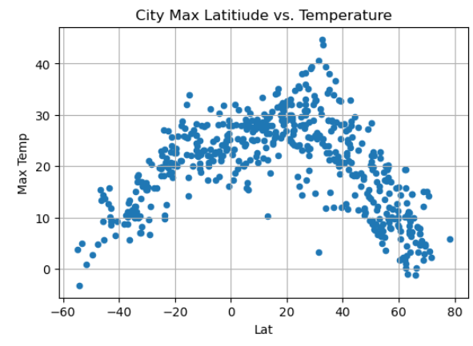

### Latitude vs. Humidity

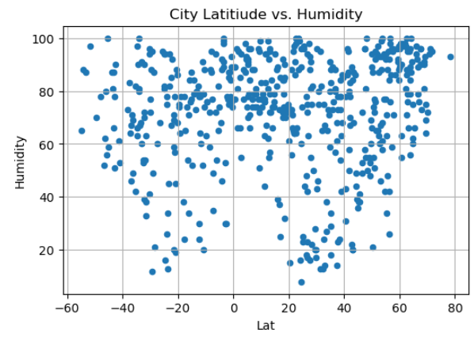

### Latitude vs. Cloudiness

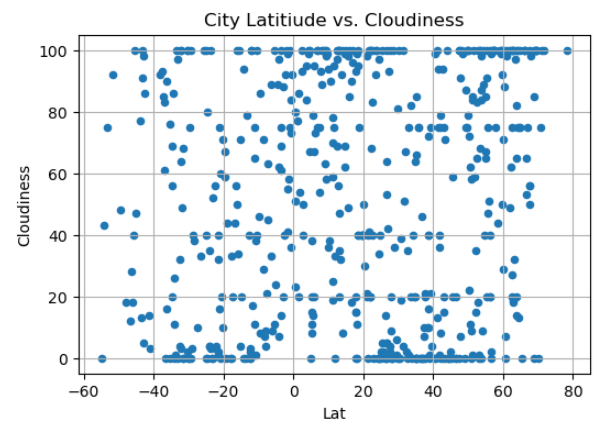

### Latitude vs. Wind Speed

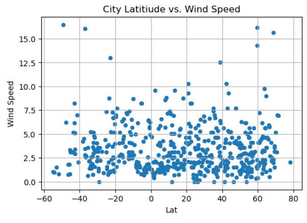

## Requirement 2: Compute Linear Regression for Each Relationship

To fulfill the second requirement, I had to compute the linear regression for each relationship. I separated the plots into Northern Hemisphere (greater than or equal to 0 degrees latitude) and Southern Hemisphere (less than 0 degrees latitude). 

Next, I created a series of scatter plots. I had to included the linear regression line, the model's formula, and the r values.

### Northern Hemisphere: Temperature vs. Latitude

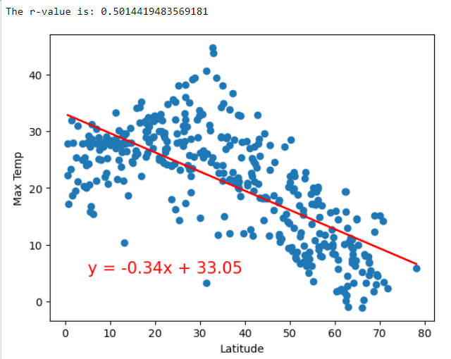

### Southern Hemisphere: Temperature vs. Latitude

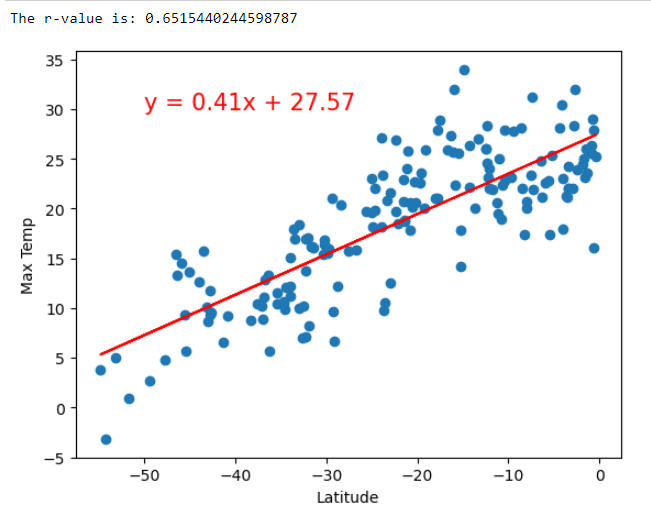

**Discussion about the linear relationship:** For the northern hemisphere as the latitude increases the maximum temperature decreases. In the sothern hemisphere as the latitude increases the maximum temperature is shown to increase. 

### Northern Hemisphere: Humidity vs. Latitude

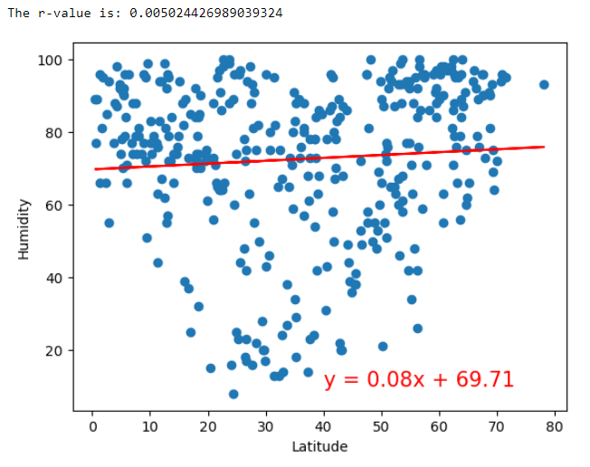

### Southern Hemisphere: Humidity vs. Latitude

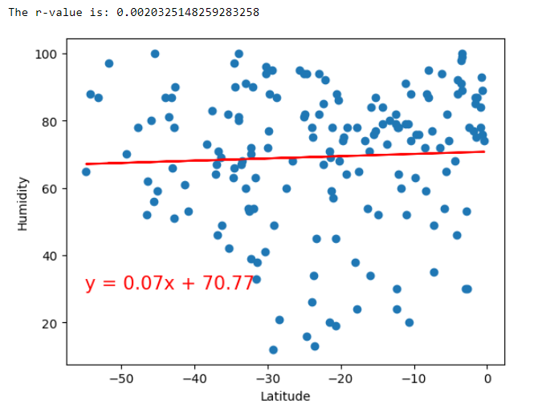

**Discussion about the linear relationship:** For the northern hemisphere and the sothern hemisphere there is not a significant increase in humidity, just a slight increase in the southern hemisphere.

### Northern Hemisphere: Cloudiness vs. Latitude

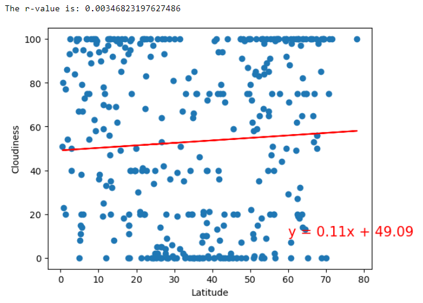

### Southern Hemisphere: Cloudiness vs. Latitude

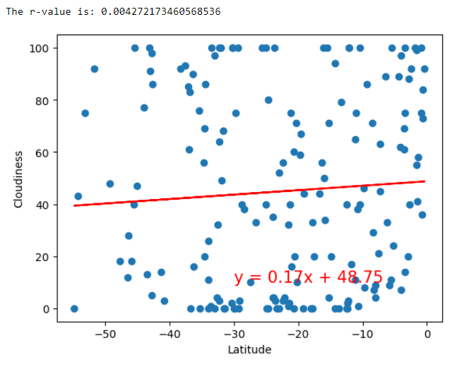

**Discussion about the linear relationship:** For the northern hemisphere and the sothern hemisphere there is not a significant increase in cloudiness, though there is a slight increase in the northern hemisphere with an increase in latitude.  

### Northern Hemisphere: Wind Speed vs. Latitude

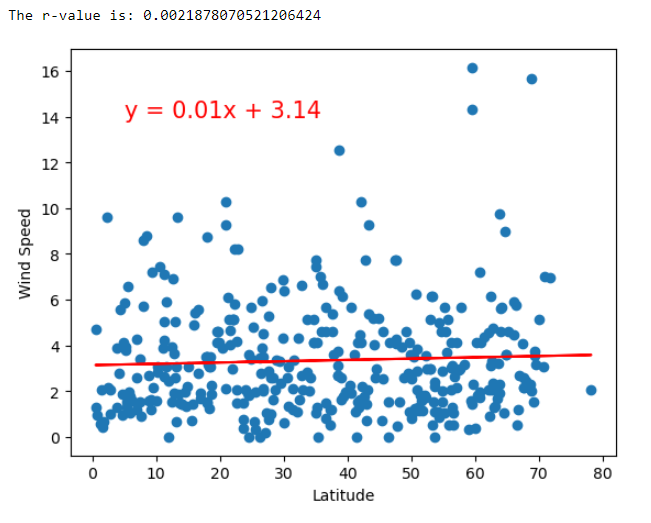

### Southern Hemisphere: Wind Speed vs. Latitude

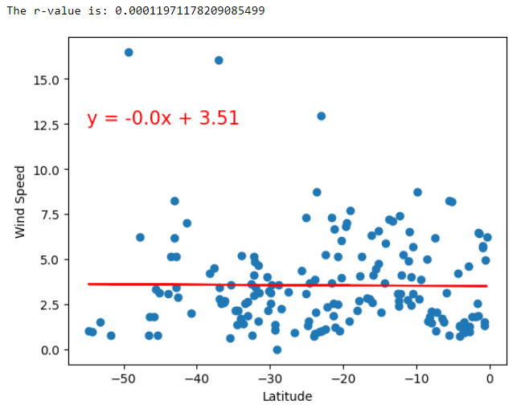

**Discussion about the linear relationship:** For the northern hemisphere the wind speed is just a bit higher with a slight increase as the latitude increases. The southern hemisphere wind speed is slightly lower but gradually increases as the latitude increases. 

# Part 2: VacationPy

In this deliverable, I'll use my weather data skills to plan future vacations. Also, I'll use Jupyter notebooks, the geoViews Python library, and the Geoapify API.

The code needed to import the required libraries and load the CSV file with the weather and coordinates data for each city created in Part 1 is provided to help me get started.

My main tasks will be to use the Geoapify API and the geoViews Python library and employ my Python skills to create map visualizations.

1. Create a map that displays a point for every city in the city_data_df DataFrame as shown in the following image. The size of the point should be the humidity in each city.

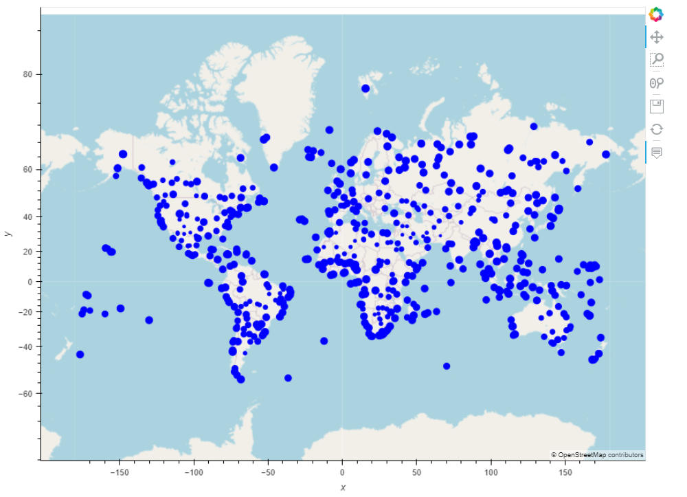

2. Narrow down the city_data_df DataFrame to find your ideal weather condition. For example:

*A max temperature lower than 27 degrees but higher than 21

*Wind speed less than 4.5 m/s

*Zero cloudiness

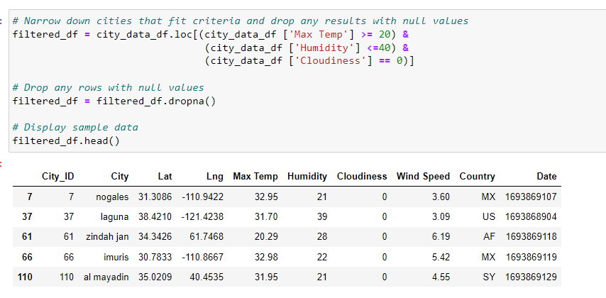

3. Create a new DataFrame called hotel_df to store the city, country, coordinates, and humidity.

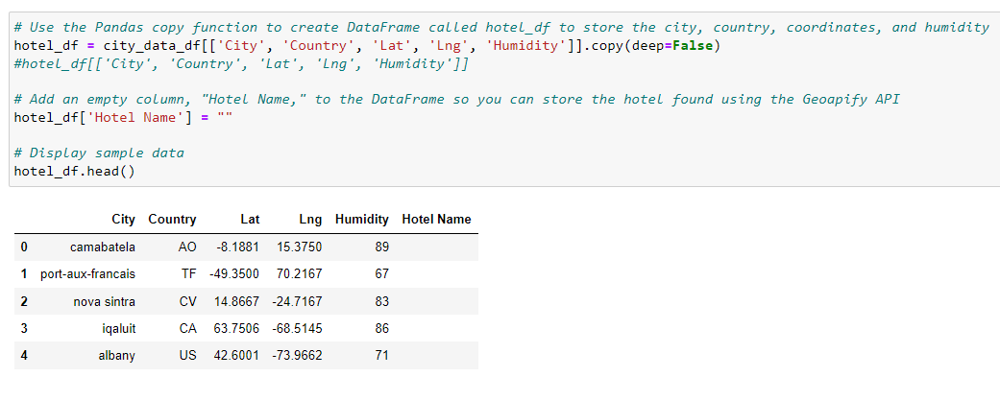

4. For each city, use the Geoapify API to find the first hotel located within 10,000 meters of your coordinates.

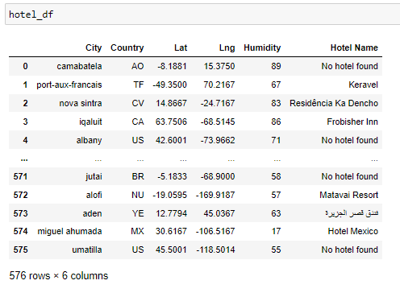

5. Add the hotel name and the country as additional information in the hover message for each city on the map.

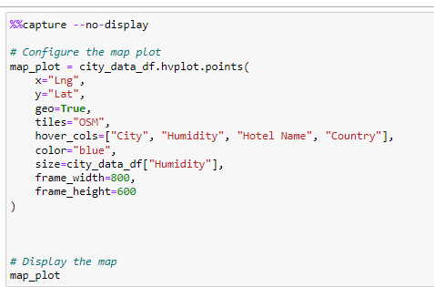